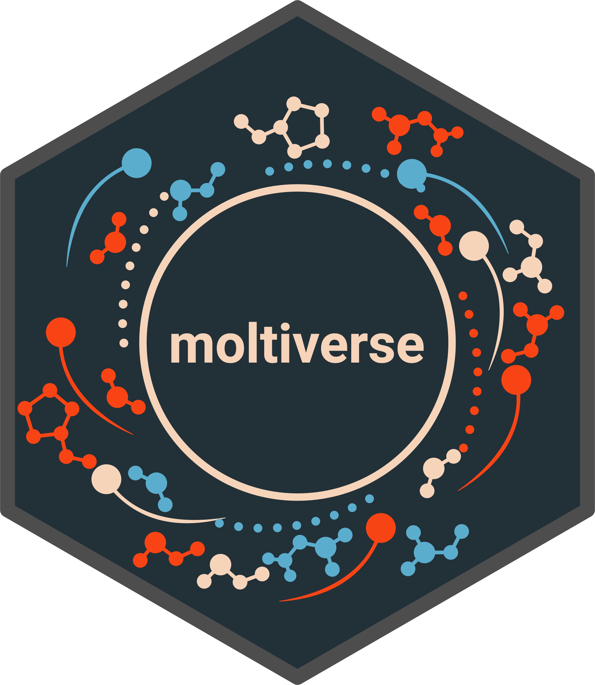

# Moltiverse

[](./assets/moltiverse_logo_color_hex_transparent.png) Moltiverse is an open-source molecular conformer generator available as a command line application written in the modern Crystal language. 

Moltiverse uses the robust ecosystem of open-source applications to process the molecules and perform conformational sampling. The conformer generation protocol consists of seven main steps: 
1. Molecular pre-processing: Conversion of SMILES code into three-dimensional coordinates using Open Babel.
2. Structure spreading.
3. Molecule parameterization with the GAFF2 force field using Amber Tools.
4. Energetic minimization.
5. Molecular sampling in vacuum with the M-eABF method using the NAMD molecular simulation engine.
6. Structure clustering.
7. Conformer ensemble refinement using electronic structure optimization calculations with XTB software.


## Installation

### Prerequisites

- NAMD 2.14 multicore software must be installed and the `namd2` executable should be in the system path.

### Quick Install

To install Moltiverse and its dependencies:

```bash
curl -fsSL https://raw.githubusercontent.com/ucm-lbqc/moltiverse/master/INSTALL.sh | bash
```

This command creates a "moltiverse" conda environment. To use Moltiverse, activate the environment:
```bash
conda activate moltiverse
```
### Verifying Installation

To check that dependencies and versions are working correctly:

```bash
moltiverse --check
moltiverse --version
```

### Custom Installation

To install a specific release or select which dependencies to install, download the 'INSTALL.sh' file and execute it:

```
bash INSTALL.sh
```

## Requirements
External software:
- [OpenBabel](https://openbabel.org)
- [Namd](https://www.ks.uiuc.edu/Research/namd/)
- [Ambertools](https://ambermd.org/AmberTools.php)
- [xTB](https://github.com/grimme-lab/xtb)

## Usage

> [!IMPORTANT]
> This application is still under development and is not ready for production. 
> Please note that we have not yet released a version or documentation. But stay tuned, we will do it soon ;).

1. Check the [examples](/data/moltiverse_v1/examples) directory for example input files:
   - [molecule.smi](/data/moltiverse_v1/examples/molecule.smi): An SMI file containing a single SMILES code and molecule name.
   - [molecules.smi](/data/moltiverse_v1/examples/molecules.smi): An SMI file with multiple SMILES codes and molecule names.
2. You can modify the SMI file with your own molecules. SMILES codes can be obtained from [PubChem](https://pubchem.ncbi.nlm.nih.gov/).
3. Running the application:
   ```bash
   moltiverse -l molecule.smi --procs 2
   moltiverse -l molecules.smi --procs 2
   ```
This command executes the entire protocol, creating a folder for each molecule in the SMI file. Each folder will contain the final conformers in various formats. The output files are as follows:

- `*mm.pdb` and `*mm.sdf`: Conformers after molecular mechanics (MM) optimization.
- `*qm.pdb` and `*qm.sdf`: Final conformers after quantum mechanics (QM) optimization. These represent the end result of the protocol.
- `*.pdb` and `*.sdf` (without suffix): Raw conformers. These are primarily for development purposes and should be avoided for analysis.

**Note**: For most analyses and applications, use the `*qm.pdb` or `*qm.sdf` files, as they represent the final, optimized conformers. The `-P` or `--procs` option assigns processor cores to run the protocol. For laptops or modest computers we recommend to use a small amount of cores (1 to 4) to avoid failures. For computing clusters, a higher number of cores is preferred.

4. To test moltiverse with a short testing protocol (not for production, just for testing), use:

   ```bash
   moltiverse -l molecule.smi --procs 2 -p test
   ```
The testing protocol performs only 0.8 ns of simulaton divided into two RDGYR windows, generating ~800 structures.
The full protocol "v1" performs 24 ns of simulation divided into 12 RDGYR windows, generating ~30000 structures.

5. Visualization

The following [Notebook](https://colab.research.google.com/drive/1YtafWMZsNL-Cyqnyqn5mAmZTKZzPvCEh?usp=sharing) can be useful to quickly visualize an output SDF file and calculate some properties.
> [!IMPORTANT]
> The notebook uses RDKit to calculate the properties, and these may differ from those calculated with [chem.cr](https://github.com/franciscoadasme/chem.cr) in our benchmark. The notebook is only for quick visualization and analysis.

## Citing

If you use `moltiverse` in your research, please consider citing the following article:

    To be added


## Contributing

1. Fork it (<https://github.com/ucm-lbqc/moltiverse/fork>)
2. Create your feature branch (`git checkout -b my-new-feature`)
3. Commit your changes (`git commit -am 'Add some feature'`)
4. Push to the branch (`git push origin my-new-feature`)
5. Create a new Pull Request

## Contributors

- [Mauricio Bedoya](https://github.com/maurobedoya) - creator and maintainer
- [Francisco Adasme](https://github.com/franciscoadasme) - maintainer

## License

    To be added

## Support

    To be added
